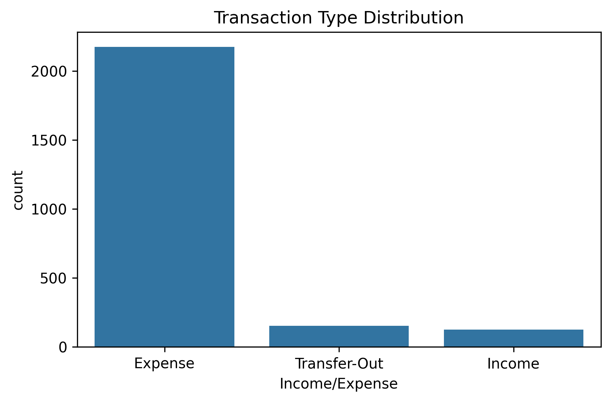
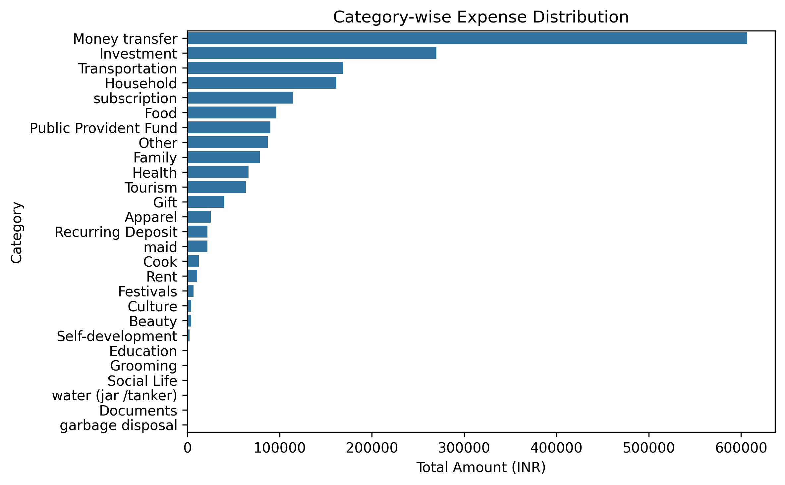
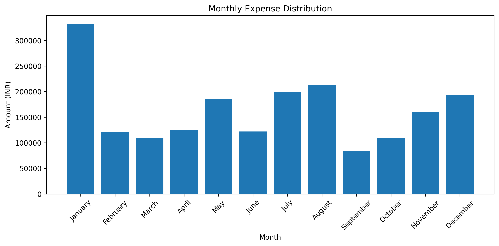
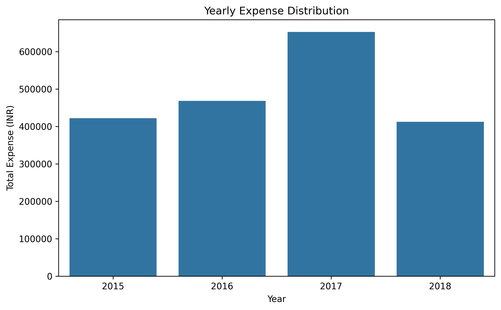
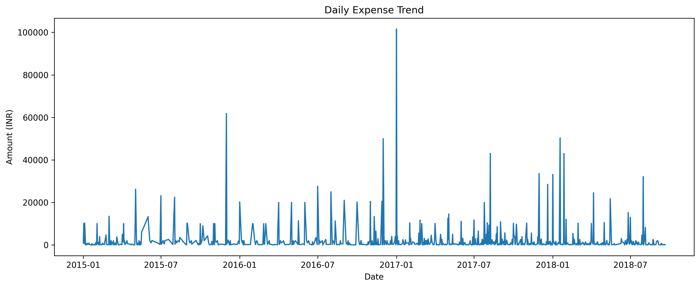

# 📊 Daily Transactions Analysis

A **Data Analysis project** focused on analyzing daily household financial transactions to uncover spending patterns, income behavior, category-wise trends, and time-based insights using **Python and data visualization**.

This project demonstrates **end-to-end data analysis**, from data cleaning and exploratory analysis to business insights and recommendations.

     

---

## 📌 Project Objective

- Analyze daily household financial transactions  
- Identify **income vs expense patterns**
- Understand **category-wise and subcategory-wise spending**
- Explore **payment mode preferences**
- Perform **time-based analysis** (daily, monthly, yearly)
- Generate **actionable business insights and recommendations**

---

## 🧰 Tools & Technologies Used

- **Python**
- **Pandas, NumPy**
- **Matplotlib, Seaborn**
- **Jupyter Notebook**

---

## 📂 Project Structure

```
├── Daily Transactions Analysis project Report.pdf
├── Daily_Household_Transactions.csv
├── Daily_Transactions_Analysis.ipynb
├── README.md
├── requirements.txt
└── images/
    ├── 01_Transaction_Type_Distribution.png
    ├── 02_Total_Amount_by_Transaction_Type.png
    ├── 03_Category-wise_Expense_Distribution.png
    ├── 04_Category-wise Income Distribution.png
    ├── 05_Top_10_Expense_Subcategories.png
    ├── 06_Top_10_Income_Subcategories.png
    ├── 07_Expense_Distribution_by_Payment_Mode.png
    ├── 08_Income_Distribution_by_Payment_Mode.png
    ├── 09_Daily_Expense_Trend.png
    ├── 10_Daily_Income_Trend.png
    ├── 11_Monthly_Expense_Distribution.png
    ├── 12_Monthly_Income_Distribution.png
    ├── 13_Yearly_Expense_Distribution.png
    ├── 14_Yearly_Income_Distribution.png
    ├── 15_Day-wise_Expense_by_year_&_month.png
    ├── 16_Income_Sources.png
    ├── 17_Expense_Sources.png
    ├── 18_Top_5_Highest_Transactions.png
    └── 19_Top_5_Lowest_Transactions.png
```


---

## 📊 Dataset Description

The dataset **Daily_Household_Transactions.csv** contains records of daily financial transactions with the following columns:

- **Date** – Date and time of transaction  
- **Mode** – Payment mode used  
- **Category** – High-level transaction category  
- **Subcategory** – Detailed transaction classification  
- **Note** – Transaction description  
- **Amount** – Transaction amount  
- **Income/Expense** – Transaction type (Income, Expense, Transfer-Out)  
- **Currency** – INR  

**Total Records:** 2,452  
**Currency:** Indian Rupees (INR)

---

## 🧹 Data Cleaning & Preprocessing

The following steps were performed:

- Converted the date column to datetime format  
- Handled missing values in subcategory and notes  
- Ensured numeric consistency for transaction amounts  
- Created time-based features:
  - Year
  - Month
  - Month Name
  - Day
- Verified data types and removed inconsistencies  

---

## 🔍 Exploratory Data Analysis (EDA)

Key analyses performed include:

- Transaction type distribution (Income, Expense, Transfer-Out)
- Category-wise and subcategory-wise expense & income analysis
- Payment mode distribution
- Daily, monthly, and yearly trend analysis
- Identification of highest and lowest transactions
- Interactive day-wise expense analysis using month & year filters

---

## 📈 Sample Visualizations

### 🔹 Transaction Type Distribution


---

### 🔹 Category-wise Expense Distribution


---

### 🔹 Monthly Expense Distribution


---

### 🔹 Yearly Expense Distribution


---

### 🔹 Daily Expense Trend


*(More visualizations are available in the `images/` folder)*

---

## 💡 Key Insights

- Expenses dominate transaction frequency, while income entries are fewer but high-value  
- Food and transportation are the primary expense drivers  
- Subscription expenses form consistent recurring costs  
- Bank accounts are the most used payment mode  
- Expenses show seasonal and event-driven spikes  
- Income sources are limited and concentrated  

---

## 📌 Business Recommendations

- Introduce category-wise budgeting for high-expense areas  
- Optimize recurring subscription costs  
- Track frequent small-value expenses to reduce cumulative impact  
- Plan savings for high-spending months  
- Diversify income sources for better financial stability  

---

## 📄 Project Report

A detailed project report is available here:  
📘 **Daily Transactions Analysis project Report.pdf**

---

## 🚀 How to Run the Project

1. Clone the repository  
```bash
git clone <https://github.com/Harsh-Belekar/Daily-Transactions-Analysis>
```

2. Install dependencies
```bash
pip install -r requirements.txt
```

3. Open the notebook
```bash
jupyter notebook Daily_Transactions_Analysis.ipynb
```

---

## 🧑‍💻 Author

**👤 Harsh Belekar**  
📍 Data Analyst | Python | SQL | Power BI | Excel | Data Visualization  
📬 [LinkedIn](https://www.linkedin.com/in/harshbelekar) | 🔗[GitHub](https://github.com/Harsh-Belekar)

📧 [harshbelekar74@gmail.com](mailto:harshbelekar74@gmail.com)

---

⭐ *If you found this project helpful, feel free to star the repo and connect with me for collaboration!*
